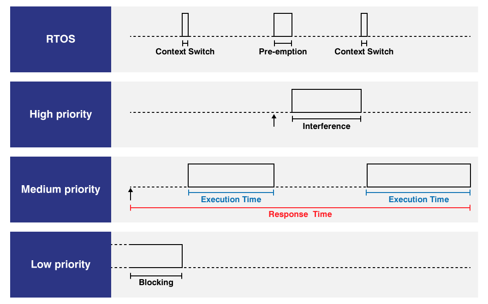

# Worst Case Execution Time

Worst Case Execution Time (WCET) is used in a real-time system to check the correct functioning and the worst cases. In this code I added two more metrics the shortest time and the current time of the task. 

In software on avionic systems it is necessary to check the conditions according to DO178B section 6.3.4. to qualify the systems. Other less critical systems can also be used to check for possible software bottlenecks. 

Currently, due to the increase in complexity in systems in cars, this technique is also used following the ISO 26262 standard.

WCET is an extremely simple tool, but of great help to developers of systems where reliability is desired.

 

Measures WCET in real-time systems. source: Rapita Systems

### References:

* [Worst-case execution time, Wikipedia](https://en.wikipedia.org/wiki/Worst-case_execution_time)
* [DO-178, Wikipedia](https://en.wikipedia.org/wiki/DO-178C);

* [Importance of Worst-Case Execution Time, Rapita Systems](https://www.rapitasystems.com/wcet-tools);

